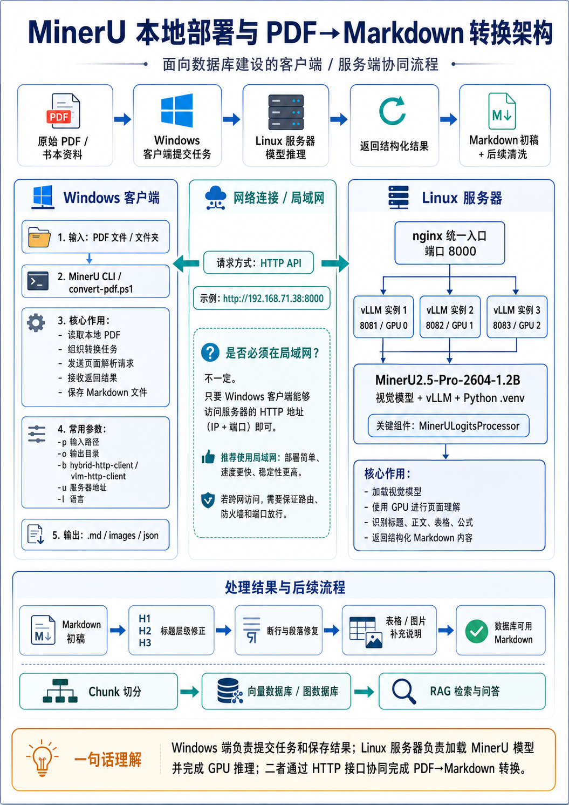

# 本地部署 MinerU 视觉模型：面向数据库建设的 PDF 转 Markdown 文档清洗流程实践

## 工作背景

在数据库建设、知识库构建和 RAG 检索系统中，原始资料的质量会直接影响后续检索、问答和知识组织效果。书本、论文、教材和扫描文档通常以 PDF 形式保存，但 PDF 本身并不是面向数据库使用的结构化文本文件。它更接近一种页面排版格式，重点是保证文档在不同设备上显示和打印时版面一致，而不是天然提供清晰的标题层级、段落结构、表格语义和章节关系。

因此，需要将pdf文件转化为文本文件。但是直接使用普通 OCR 解析工具把 PDF 转换成纯文本，往往会破坏原始文档结构，导致后续数据质量下降。常见问题包括：

* 文本阅读顺序混乱；
* 标题层级无法准确保留；
* 段落被错误切断或合并；
* 表格、公式和图片难以被正确还原；
* 目录与正文标题之间的对应关系丢失；
* 后续数据库 chunk 切分缺乏稳定依据；
* 检索结果缺少章节上下文，影响回答准确性。

对于数据库建设来说，前期文档处理的核心目标不是简单“把 PDF 中的文字提取出来”，而是尽可能保留原始文档中的结构信息，包括标题、章节、段落、表格、公式、图片位置以及正文阅读顺序。

因此，在正式建设数据库之前，需要先完成一个关键步骤：将 PDF 转换为结构较完整、语义较清晰、便于后续处理的 Markdown 文件。Markdown 相比普通 OCR 文本更适合作为中间数据格式，因为它能够保留标题层级、段落结构、列表、表格和公式等信息，也更便于后续进行自动化清洗、chunk 构建和数据库入库。

我在本阶段主要负责语料清洗与数据库文件预处理工作，具体任务是将原始书本、论文和其他 PDF 文档，通过本地部署的 MinerU 视觉模型转换为 Markdown 文件，为后续数据库建设、知识库构建和 RAG 检索系统提供质量更高的基础语料。

## 工作内容

本阶段我的主要工作包括：

1. 在公司服务器上部署 MinerU 视觉模型；
2. 使用 vLLM 将 MinerU 模型启动为本地推理服务；
3. 配置服务器端 GPU 推理环境；
4. 通过 nginx 对多个 vLLM 实例进行统一访问和负载分发；
5. 在 Windows 主机上通过终端命令调用服务器模型；
6. 使用 MinerU 对书本、论文和其他 PDF 文件进行 Markdown 转换；
7. 总结 PDF 转 Markdown 的质量边界和后续清洗规范；
8. 为后续员工接手该流程提供启动、转换、排查和优化说明。

这项工作的定位不是简单的 OCR，而是面向数据库建设的数据预处理工程。它的目标不是只把 PDF 中的文字提取出来，而是尽可能恢复文档中的标题、正文、表格、公式和阅读顺序。

## 服务器部署 MinerU 模型



### 为什么选择 MinerU

传统 OCR 工具主要解决“识别文字”的问题，但数据库建设需要的不只是文字，还需要文档结构。

普通 OCR 可能能够识别出页面中的文字，但它通常无法稳定处理：

* 标题和正文的区分；
* 多栏论文的阅读顺序；
* 表格结构；
* 数学公式；
* 图片和正文之间的关系；
* 目录与正文之间的对应关系。

MinerU 的优势在于它采用视觉模型进行文档理解。它会先把 PDF 页面渲染成图片，再由视觉语言模型识别页面中的版面结构和文字内容，最后输出 Markdown 格式的结构化文本。在实际使用中，MinerU 对大多数 PDF 文件都能完成转换，当前文档只讨论语料的初步处理。

### 服务器端安装 MinerU

服务器端安装 MinerU 的本质，是将 HuggingFace 上的 MinerU 视觉模型下载到 Linux 服务器，并使用 vLLM 将其加载为一个可通过 HTTP 调用的模型服务。

整个过程可以概括为：

```text
下载 MinerU 模型
    ↓
准备 Python 和 vLLM 环境
    ↓
加载模型到 GPU
    ↓
暴露 HTTP 服务接口
    ↓
Windows 主机提交 PDF
    ↓
服务器返回 Markdown 结果
```

#### 1、MinerU 视觉模型来源

当前使用的 MinerU 视觉模型发布在 HuggingFace 上：[https://huggingface.co/opendatalab/MinerU2.5-Pro-2604-1.2B](https://huggingface.co/opendatalab/MinerU2.5-Pro-2604-1.2B)

模型名称为：`MinerU2.5-Pro-2604-1.2B`

该名称可以拆解为：

`MinerU2.5`：表示 MinerU 2.5 版本；
`Pro`：表示专业版模型；
`2604`：表示 2026 年 4 月版本；
`1.2B`：表示模型参数量约为 12 亿。

从工程角度看，这个模型可以理解为一个专门用于文档页面理解的视觉语言模型。它接收 PDF 页面渲染后的图片，并输出对应的结构化 Markdown 内容。

#### 2、模型文件下载方式

模型通常通过 HuggingFace 的标准下载机制获取。下载后，模型会被保存到服务器的模型目录中。

常见目录结构如下：

```text
mineru_model/
└── hub/
    └── models--opendatalab--MinerU2.5-Pro-2604-1.2B/
        ├── blobs/
        ├── refs/
        └── snapshots/
            └── d3f5e08d073c21466bbabe21c71bb1e9c2e595da/
                ├── model.safetensors
                ├── config.json
                ├── tokenizer.json
                ├── tokenizer_config.json
                ├── vocab.json
                ├── merges.txt
                ├── generation_config.json
                ├── preprocessor_config.json
                ├── chat_template.jinja
                └── special_tokens_map.json
```

其中：

* `model.safetensors` 是模型权重文件；
* `config.json` 是模型架构配置文件；
* `tokenizer.json` 和相关文件用于文本分词；
* `preprocessor_config.json` 用于图像预处理；
* `generation_config.json` 用于生成参数配置；
* `snapshots/` 目录保存的是某一个具体版本的模型快照。

模型可以通过以下方式下载：

```bash
huggingface-cli download opendatalab/MinerU2.5-Pro-2604-1.2B \
  --local-dir ./mineru_model/hub/models--opendatalab--MinerU2.5-Pro-2604-1.2B
```

也可以通过 Python 的 `huggingface_hub` 库下载：

```bash
python -c "
from huggingface_hub import snapshot_download

snapshot_download(
    'opendatalab/MinerU2.5-Pro-2604-1.2B',
    local_dir='./mineru_model/hub/models--opendatalab--MinerU2.5-Pro-2604-1.2B'
)
"
```

下载完成后，需要确认模型快照目录存在，并且其中包含完整的权重文件和配置文件。否则后续 vLLM 无法正常加载模型。

#### 3、vLLM 的作用

模型文件下载完成后，还不能直接使用。模型需要由推理框架加载到 GPU 中，才能接收请求并生成结果。当前使用的是 vLLM。

可以简单理解为：

> 模型文件 + vLLM + GPU = 可运行的 MinerU 模型服务

vLLM 的作用主要包括：

* 读取 MinerU 模型路径；
* 将模型加载到 GPU 显存中；
* 管理模型推理过程；
* 对外暴露 HTTP API；
* 接收 Windows 主机发送的页面图片；
* 返回模型生成的 Markdown 内容。

因此，vLLM 在这里相当于 MinerU 模型的“运行引擎”。MinerU 模型负责理解文档页面，vLLM 负责让模型稳定运行并对外提供服务。

#### 4、启动 MinerU 模型服务

当前服务器端通过启动脚本运行 MinerU 模型服务。核心启动逻辑可以简化理解为：

```bash
CUDA_VISIBLE_DEVICES=2 \
VLLM_USE_FLASHINFER_SAMPLER=0 \
setsid .venv/bin/vllm serve "/path/to/model/snapshot" \
  --host 0.0.0.0 \
  --port 8000 \
  --served-model-name opendatalab/MinerU2.5-Pro-2604-1.2B \
  --logits-processors mineru_vl_utils:MinerULogitsProcessor \
  --dtype float16 \
  --max-model-len 8192 \
  --max-num-seqs 1 \
  --gpu-memory-utilization 0.85
```

这个命令的含义是：指定一张 GPU，使用 vLLM 加载 MinerU 模型，并在服务器上开放一个 HTTP 服务端口，供 Windows 主机远程调用。

主要参数说明如下：

| 参数                              | 含义                                                |
| :-------------------------------- | :-------------------------------------------------- |
| `CUDA_VISIBLE_DEVICES`          | 指定当前 vLLM 实例使用哪一张 GPU                    |
| `VLLM_USE_FLASHINFER_SAMPLER=0` | 关闭 FlashInfer 采样器，提高当前环境下的兼容性      |
| `vllm serve`                    | 使用 vLLM 的服务模式运行模型                        |
| `--host 0.0.0.0`                | 监听所有网络接口，使 Windows 主机可以通过局域网访问 |
| `--port 8000`                   | 服务监听端口                                        |
| `--served-model-name`           | 对外暴露的模型名称                                  |
| `--logits-processors`           | 指定 MinerU 专用输出处理器                          |
| `--dtype float16`               | 使用半精度浮点运行模型，降低显存占用                |
| `--max-model-len 8192`          | 设置单次请求的最大 token 长度                       |
| `--max-num-seqs`                | 设置同时处理的最大请求数量                          |
| `--gpu-memory-utilization`      | 设置 GPU 显存使用比例                               |

在当前实际部署中，如果服务器有多张 GPU，可以为每张 GPU 启动一个 vLLM 实例，然后通过 nginx 将外部请求分发到不同 GPU 后端。这样可以提高整体转换效率。

## 客户端调用 MinerU：采用 windows 电脑调用 mineru 清洗文本

服务器端 MinerU 模型启动完成后，Windows 电脑就可以作为客户端调用服务器上的 MinerU 服务，对本地 PDF 文件进行 Markdown 转换。

在这个工作流中，Windows 端不需要加载 MinerU 视觉模型，也不需要承担 GPU 推理任务。Windows 端主要负责三件事：

1. 指定需要转换的 PDF 文件；
2. 指定 Markdown 文件的输出目录；
3. 将 PDF 页面发送给服务器端 MinerU 模型，并接收转换结果。

也就是说，Windows 电脑是任务提交端，Linux 服务器是模型推理端。

整体流程可以理解为：

```text
Windows 电脑
    ↓ 提交 PDF 文件
Linux 服务器 MinerU 服务
    ↓ 模型解析 PDF 页面
返回 Markdown 结果
    ↓
Windows 电脑保存 Markdown 文件
```

### 什么是 MinerU CLI

CLI 是 Command Line Interface 的缩写，中文可以理解为"命令行工具"。MinerU CLI 指的是可以在终端中通过 `mineru` 命令调用 MinerU 功能的工具。安装地址：[github.com/opendatalab/MinerU](https://github.com/opendatalab/MinerU)

在当前工作流中，Windows 端需要安装 MinerU CLI。它的作用不是加载服务器上的视觉大模型，而是作为客户端读取本地 PDF 文件、组织转换任务、调用服务器端 MinerU 服务，并将返回结果保存为 Markdown 文件。

可以简单理解为：

```text
Windows 端 MinerU CLI
    ↓
读取 PDF 文件
    ↓
调用 Linux 服务器上的 MinerU 模型服务
    ↓
接收解析结果
    ↓
保存 Markdown 文件
```

因此，MinerU CLI 是任务提交入口，真正的大模型推理仍然由 Linux 服务器完成。

MinerU CLI 安装完成后，可以通过以下命令检查：

```powershell
mineru --help
mineru -v
```

如果能够正常显示帮助信息和版本号，说明 Windows 端的 MinerU CLI 可以正常使用。

### Windows 端的 MinerU 命令

Windows 端可以通过终端命令调用 MinerU。示例命令如下：

```batch
mineru -p "Vol_02_RADAR_AIDS_TO_NAVIGATION.pdf" ^
       -o "H:\booksdownload\booksdownload1" ^
       -b vlm-http-client ^
       -u http://192.168.71.38:8000 ^
       -l ch
```

该命令的作用是：将 `Vol_02_RADAR_AIDS_TO_NAVIGATION.pdf` 这个 PDF 文件提交给服务器端 MinerU 服务，服务器完成解析后，将生成的 Markdown 文件保存到指定输出目录中。

参数说明

| 参数   | 示例值                                    | 含义                                     |
| :----- | :---------------------------------------- | :--------------------------------------- |
| `-p` | `"Vol_02_RADAR_AIDS_TO_NAVIGATION.pdf"` | 指定需要转换的 PDF 文件路径              |
| `-o` | `"H:\booksdownload\booksdownload1"`     | 指定 Markdown 文件的输出目录             |
| `-b` | `vlm-http-client`                       | 指定后端模式，表示使用远程 HTTP 模型服务 |
| `-u` | `http://192.168.71.38:8000`             | 指定 Linux 服务器上的 MinerU 服务地址    |
| `-l` | `ch`                                    | 指定文档语言，`ch` 表示中文            |

其中最关键的是：

```text
-b vlm-http-client
```

这个参数表示 Windows 端不在本地加载模型，而是通过 HTTP 请求调用远程服务器上的 MinerU 模型服务。

### Mineru 模式说明

MinerU 支持不同的后端模式，常见模式包括：

```text
-b vlm-http-client  → 远程 HTTP API 模式
-b vlm-local        → 本地直接加载视觉模型
-b vllm-engine      → 通过 vLLM engine 调用
```

当前工作流采用的是：

```text
-b vlm-http-client
```

也就是远程 HTTP API 模式。

三种模式的架构对比如下：

```text
vlm-http-client（远程 HTTP API，当前采用）：
┌─────────────────┐         HTTP          ┌─────────────────────────┐
│  Windows 主机    │ ───────────────────→ │  Linux 服务器             │
│  MinerU CLI      │                       │  vLLM + MinerU 模型 + GPU │
│  (仅提交任务)    │ ←─────────────────── │  (模型推理)              │
└─────────────────┘      返回 Markdown     └─────────────────────────┘

vlm-local（本地直接加载模型）：
┌───────────────────────────────────────┐
│  Windows 主机                          │
│  MinerU CLI + 本地模型 + 本地 GPU      │
│  (任务提交 + 模型推理全在本机)          │
└───────────────────────────────────────┘

vllm-engine（通过 vLLM engine 调用）：
┌─────────────────┐       vLLM协议       ┌─────────────────────────┐
│  Windows 主机    │ ───────────────────→ │  Linux 服务器             │
│  MinerU CLI      │                       │  vLLM Engine + 模型 + GPU│
│  (仅提交任务)    │ ←─────────────────── │  (模型推理)              │
└─────────────────┘      返回 Markdown     └─────────────────────────┘
```

这种模式最适合当前服务器部署场景。因为模型已经部署在 Linux 服务器上，Windows 端只需要把 PDF 转换任务发送到服务器，不需要在本机安装和加载大模型。